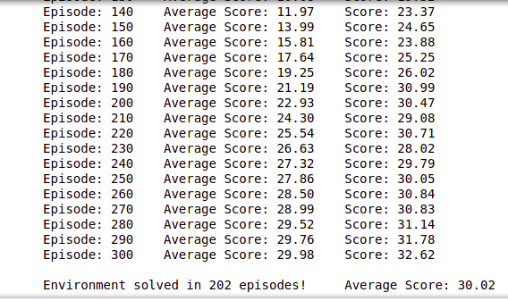
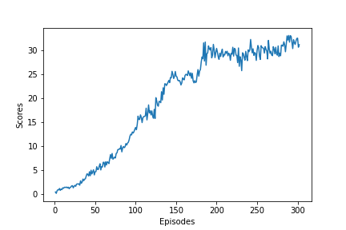

# Report of Udacity Deep Reinforcement Learning Nanodegree Project 2: Continuous Control

## Introduction
This project is part of the [Deep Reinforcement Learning Nanodegree Program](https://www.udacity.com/course/deep-reinforcement-learning-nanodegree--nd893), by Udacity.  

## Project's goal
The goal of this project is to create and train a double-jointed arm agent that is able to maintain its hand in contact with a moving target for as many time steps as possible. The observation space consists of 33 variables corresponding to position, rotation, velocity, and angular velocities of the arm. Each action is a vector with four numbers, corresponding to torque applicable to two joints. Every entry in the action vector should be a number between -1 and 1. The environment is considered solved if a reward of +100 is obtain for 30 consecutive episodes. The method to use is an actor-critic algorithm, the Deep Deterministic Policy Gradients (DDPG) algorithm.

**Task 1: Solve the First Version**

The task is episodic, and in order to solve the environment, the agent must get an average score of +30 over 100 consecutive episodes. 

**Task 2: Solve the Second Version**

The barrier for solving the second version of the environment is slightly different, to take into account the presence of many agents. In particular, the agents must get an average score of +30 (over 100 consecutive episodes, and over all agents).

**In have implemented the Task 2 (20 Agents) using DDPG algorithm.**

## Development
The agent is trained with the DDPG algorithm as described in this paper: [Continuous control with deep reinforcement learning](https://arxiv.org/abs/1509.02971).

## Network architecture

### Architecture of Actor Network

- **Input size** : 33
- **Output size** : 4
- 2 hidden layers and one output layer
- One hidden layer has 256 hidden units and other one with 128 hidden units, both of them followed by a `ReLU` activation layer
- We have a batch normalization layer after the first layer
- Output layer is followed by a tanh activation layer

### Architecture of Critic Network**

- **Input size** : 4
- **Output size** : 1
- 2 hidden layers and one output layer
- One hidden layer has 256 hidden units and other one with 128 hidden units, both of them followed by a `ReLU` activation layer
- We have a batch normalization layer after the first layer
- Output layer is followed by a linear activation unit

### Hyperparameters

* BUFFER_SIZE = 1e6  # replay buffer size
* BATCH_SIZE = 1024        # minibatch size
* GAMMA = 0.99            # discount factor
* TAU = 1e-3              # for soft update of target parameters
* LR_ACTOR = 1e-4         # learning rate of the actor
* LR_CRITIC = 3e-4        # learning rate of the critic
* WEIGHT_DECAY = 0.0001       # L2 weight decay
* n_episodes=2000         # maximum number of episodes to train
* max_t=5000              # maximum number of steps to train per episode

## Plot of Rewards

**The objective to get and average score of 30+ achieved as shown in the image.**

## Ideas for Future Work

* Implementing other models such as GAE, A3C, TRPO could be implemented and tested to check if they can give improved results.
* Improved hyperparameter tuning can provide improved results.
* Negative penalty can be introduced to prevent Agent from taking wrong decisions.
